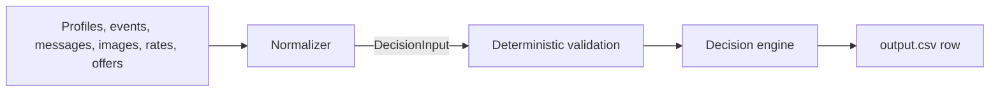

# Boundary Contract v1.0.0

The contract is the only interface between the two halves of the system. The
normalizer interprets messy evidence; the decision engine does arithmetic on a
clean, dated timeline. Everything ambiguous must be resolved before it crosses
this line.

Source of truth: [`code/contracts/models.py`](../code/contracts/models.py).
Generated schema: [`code/contracts/financial_boundary.schema.json`](../code/contracts/financial_boundary.schema.json).



## Ownership

| Concern | Owner |
|---|---|
| Currency conversion, recurrence detection, conflict resolution, image and message reading | Normalizer |
| Forecasting the balance, sizing payments, choosing and ranking plans | Decision engine |

The engine never re-reads `dataset/`. If a fact is not in `DecisionInput`, it
does not exist as far as the recommendation is concerned.

## Core principles

- `opening_balance` is the user's balance **on** `as_of_date`. History that is
  already settled is baked into it and must never be replayed as a cash flow.
- Every amount is a `Decimal` in the user's home currency, serialized as a
  string. No floats cross the boundary.
- The normalizer emits a **fully materialized** 90-day timeline. The engine
  expands nothing and infers no recurrence.
- Every derived fact carries `sources` so a wrong answer can be traced to the
  normalizer or the engine.

## `FinancialState`

| Field | Meaning |
|---|---|
| `as_of_date` / `forecast_end_date` | Window boundaries; the end is exactly 90 days after the start |
| `opening_balance` | Authoritative balance on `as_of_date` |
| `minimum_balance_to_keep` | Floor the projected balance may never break |
| `preferences` | Priorities, protected/reducible/stoppable categories, accepted methods, installment cap |
| `cash_flows` | Every dated movement inside the window |
| `adjustable_series` | Flexible recurring expenses the engine may stop or reduce |
| `evidence_resolutions` | How each ambiguity was settled, and on what basis |
| `excluded_evidence` | What was deliberately left out, and why |
| `assumptions` | Conservative judgements a reviewer should see |
| `attestation` | The model's sign-off on this state |

### `CashFlowOccurrence`

One dated movement. `amount` is always positive; `direction` carries the sign.
`origin` explains why it is on the timeline:

| Origin | Direction | Typical source |
|---|---|---|
| `confirmed_income` | inflow | Scheduled salary, or a message confirming amount and date |
| `recurring_income_forecast` | inflow | A salary pattern that continues into the window |
| `reserved_pending_debit` | outflow | A pending debit that will land |
| `scheduled_debit` | outflow | A dated future obligation |
| `recurring_expense_forecast` | outflow | Rent, subscriptions, loan instalments |
| `variable_essential_forecast` | outflow | Groceries and similar, forecast conservatively |
| `committed_one_time_debit` | outflow | A one-off obligation, e.g. an amount read from a bill image |

There is **no origin** for pending credits, unrealized valuations, cancelled
records, or failed debits with no retry. Those cannot become projected cash, so
the enum cannot express them; they belong in `excluded_evidence`.

When a record was converted from another currency, `original_currency`,
`original_amount`, and `exchange_rate_date` are all set together and the flow
cites the `exchange_rate` row it used.

### `AdjustableSeries`

`spending_changes_needed` must name a real `event_id`, so each series carries
`target_event_id` alongside the `occurrence_ids` that stopping or reducing it
would change. The action must match what the profile permits, the category must
not be protected, and a reducible series must state the floor it cannot go
below.

## `EnrichedRequest`

The raw request plus its seller offers, because options are request-specific
rather than part of the user's general financial position. Each `PaymentOption`
arrives with its schedule already expanded to exact dates, so the engine only
simulates it.

An option being *present* says nothing about whether it is *eligible*: rejecting
an offer that exceeds `max_installment_months`, or a method the user will not
consider, is the engine's job.

## Validation

Structural rules are enforced by the models on construction. Policy and
cross-record rules live in
[`code/contracts/validation.py`](../code/contracts/validation.py) and are graded:

- **Errors** make the state unusable: a protected category marked adjustable, a
  recurring projection with no history behind it, an event both excluded and
  projected, an offer whose fee and total disagree with the requested amount.
- **Warnings** are worth a reviewer's attention but do not block: an opening
  balance already under the minimum, a full-payment offer carrying a fee.

`assert_valid` raises on errors and returns the warnings. Validation failures
are the normalizer's feedback signal: the message names the field, so the state
can be regenerated with the specific problem quoted back to the model.

## Versioning

`schema_version` is pinned to `1.0.0`. Any change to field meaning requires a
version bump, because both halves of the system are compiled against these
assumptions. Regenerate the schema after model changes:

```bash
cd code && python3 -m contracts.generate_schema
```
